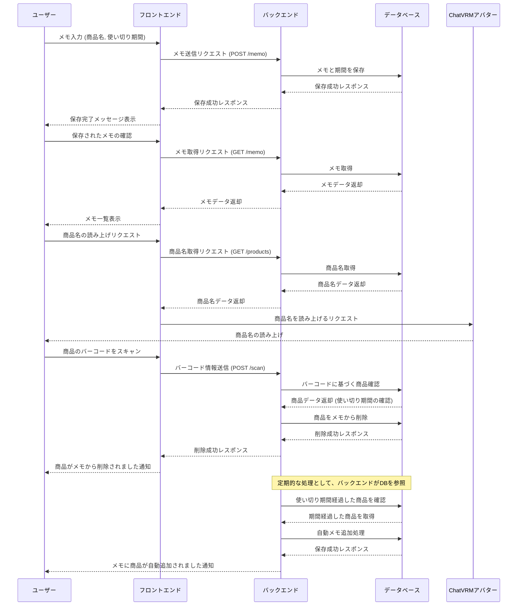

# HACK-U
以下シーケンス図です．変なところは修正しちゃってください．

```mermaid
sequenceDiagram
    participant User as ユーザー
    participant FE as フロントエンド
    participant BE as バックエンド
    participant DB as データベース
    participant ChatVRM as ChatVRMアバター

    User->>FE: メモ入力 (商品名, 使い切り期間)
    FE->>BE: メモ送信リクエスト (POST /memo)
    BE->>DB: メモと期間を保存
    DB-->>BE: 保存成功レスポンス
    BE-->>FE: 保存成功レスポンス
    FE-->>User: 保存完了メッセージ表示

    User->>FE: 保存されたメモの確認
    FE->>BE: メモ取得リクエスト (GET /memo)
    BE->>DB: メモ取得
    DB-->>BE: メモデータ返却
    BE-->>FE: メモデータ返却
    FE-->>User: メモ一覧表示

    User->>FE: 商品名の読み上げリクエスト
    FE->>BE: 商品名取得リクエスト (GET /products)
    BE->>DB: 商品名取得
    DB-->>BE: 商品名データ返却
    BE-->>FE: 商品名データ返却
    FE->>ChatVRM: 商品名を読み上げるリクエスト
    ChatVRM-->>User: 商品名の読み上げ

    User->>FE: 商品のバーコードをスキャン
    FE->>BE: バーコード情報送信 (POST /scan)
    BE->>DB: バーコードに基づく商品確認
    DB-->>BE: 商品データ返却 (使い切り期間の確認)
    BE->>DB: 商品をメモから削除
    DB-->>BE: 削除成功レスポンス
    BE-->>FE: 削除成功レスポンス
    FE-->>User: 商品がメモから削除されました通知

    note over BE, DB: 定期的な処理として、バックエンドがDBを参照
    BE->>DB: 使い切り期間経過した商品を確認
    DB-->>BE: 期間経過した商品を取得
    BE->>DB: 自動メモ追加処理
    DB-->>BE: 保存成功レスポンス
    BE-->>User: メモに商品が自動追加されました通知
```
