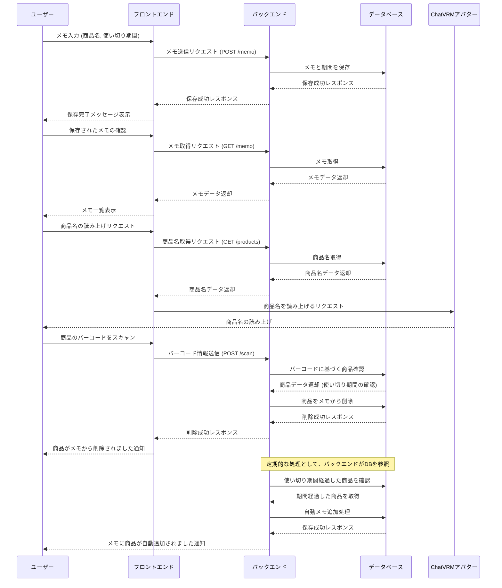

# 同棲彼女からのお使いメモ

- [発表スライドはこちら](https://www.canva.com/design/DAGRG-ZJbtA/Ni4mGHB5DEEIhurEOsnjSA/edit)
- [デモ動画はこちら(音でます！)](https://drive.google.com/file/d/1N8QG7fGLCDmdEzANq-Pex-fPUQuixr5P/view?usp=drive_link)
## 概要
消耗品がなくなりそうになったときに買い物メモに追加し、VRアバターが買い物メモを読み上げてくれるサービスです。  
消耗品は登録する必要があり、
- 手動で追加
- バーコードを読み込んで追加

の2パターンがあります。  
追加の際に消費期間を設定し、期間が過ぎると自動的に買い物メモに追加されます。

## 目的
何がなくなりそうか考えたり、買い物に行く気が起きなかったりというような買い物の面倒な部分をサポートするアプリを作ること。  
審査員賞とハッピーハッキング賞というハッカソン参加者の最多投票賞の2つの賞があり、ハッピーハッキング賞をとることを目指した。

## 使用技術
- Next.js
- Express.js
- PostgreSQL

## 機能一覧
Aituberkitの手を加えていない部分の機能は除きます。
- メモ読み上げ機能
    - VoiceVox nemo読み上げボイス連携機能
- メモ編集機能
    - メモの手動追加機能
    - 消耗品のメモ自動追加機能
- バーコード読み取り機能
    - 消耗品登録機能
    - 読み取った消耗品をメモから自動削除機能

## シーケンス図

