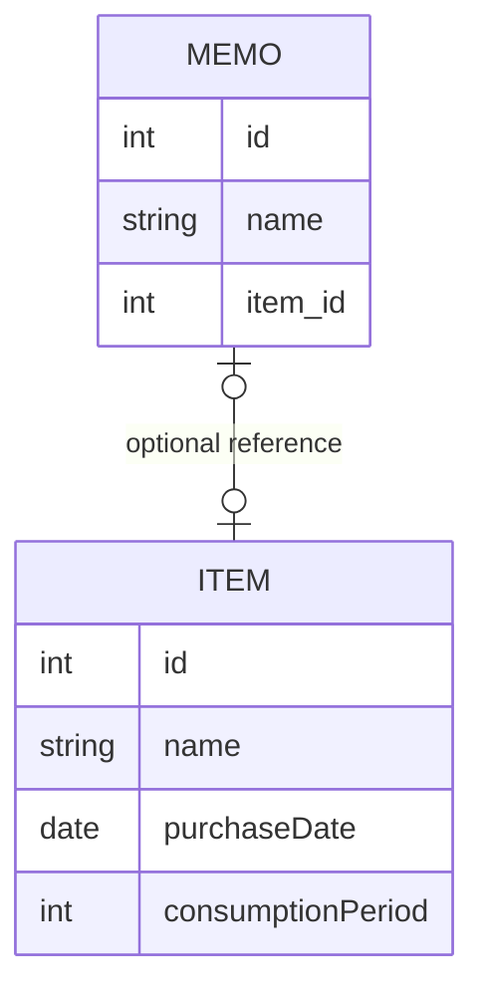

## ER図

```mermaid
erDiagram
    MEMO {
        int id
        string name
        int item_id
    }
    
    ITEM {
        int id
        string name
        date purchaseDate
        int consumptionPeriod
    }

    MEMO |o--o| ITEM : "optional reference"
```
