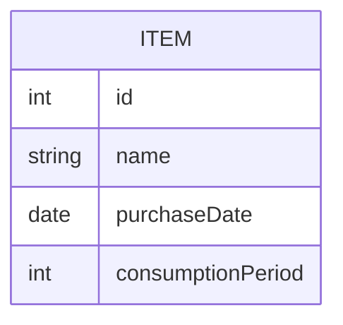

## ER図

<Dockerの操作>
Docker起動
    docker-compose up -d
Docker停止
    docker-compose down

データベースの削除
Dockerのvolumeを確認
    docker volume ls
Dockerのvolumeの削除
    docker volume rm [ボリューム名]

コンテナの実行環境に移動(VSCodeでDockerのDBを操作できる)
    docker exec -it hack-u psql -U user -d DB

Dockerのログの確認(エラーを確認する時に使う)
    docker logs hack-u