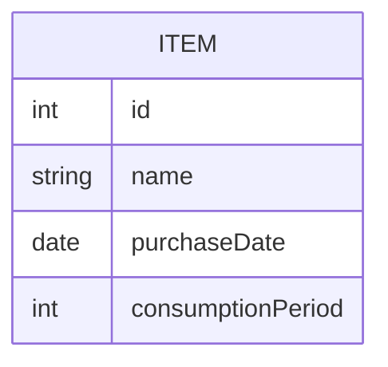

## ER図

```mermaid
erDiagram
    ITEM {
        int id
        string name
        date purchaseDate
        int consumptionPeriod
    }
```

<Dockerの操作>
Docker起動
    docker-compose up -d
Docker停止
    docker-compose down

データベースの削除
Dockerのvolumeを確認
    docker volume ls
Dockerのvolumeの削除
    docker volume rm [ボリューム名]

